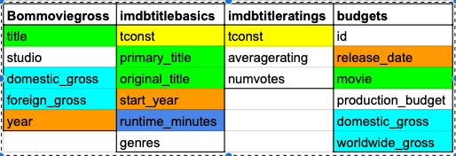
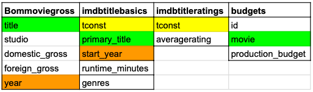
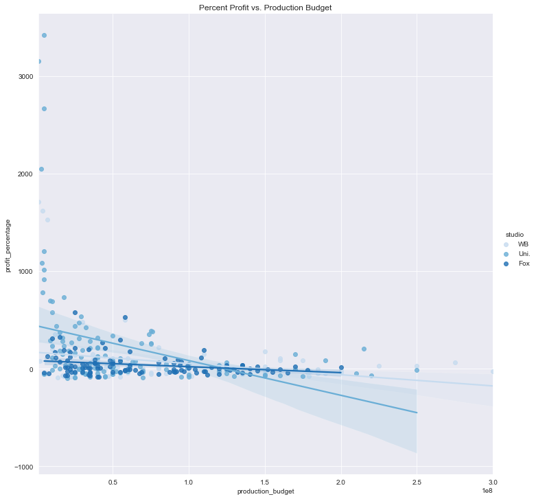
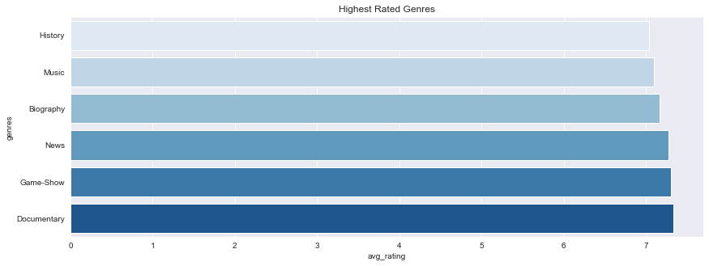
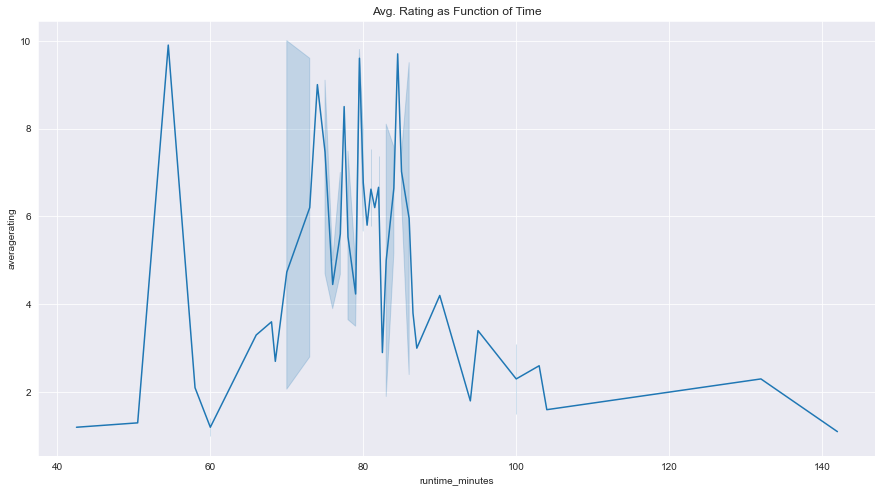

# Movie Market Analysis
An exploration of trends in the film industry

**Author**: Carlos Garza

## Overview

This notebook contains an analysis of the current trends in the film industry to provide insight and recommendations in relation to the new Microsoft movie studio. Using data from IMDb, Box Office Mojo, and the-numbers.com, actionable recommendations were reached in relation to effective movie budgets, successful movie genres, and the optimal runtime to promote high ratings.

The data, methodology, and derived conclusions are detailed in the body of this document.

## Business Problem

With Microsoft looking to break into the film industry, it is imperative that their investment is well informed. With that in mind, I explored data to provide informed strategy recommendations in regards to ideal investment size, successful movie genres, and effective movie run times to maximize ratings and interest. These strategies have been observed to be effective and profitable business solutions.

## Data

The data used in this project comes from IMDb, Box Office Mojo, and the-numbers.com. the data is summarized below.




Each table of raw data is represented in the table by the table's name and respective column names. Some highlighting has been done to aid in visualizing what data these tables might have in common.

The columns I made use of are displayed in the slimmed down table below.



***

## Methods
This is a short summary of my method of operation. My thought process is detailed in [my Jupyter Notebook](./master_analysis.ipynb)
### 1. Budget Exploration

I explored the ideal budget range using the Box Office Mojo movie gross table and the table of movie budgets from the-numbers.com

joining at bommoviegross.title == budgets.movie, I was able to create new columns for profit and percent profit and plot percent profit against production budget for the three studios that create the most content/have the most experience. This allowed me to draw conclusions on an ideal budget range.

### 2. Genre Exploration

Using data from IMDb's title basics and title ratings tables, I explored what genres perform best in the ratings. To do this, I combined the tables at their tconst columns, split the list of genres associated with each movie, and observed what the average rating was among the movies associated with each genre. The data was summarized into a bar graph for ease of data visualization.

### 3. Ideal Documentary Length

With Documentaries emerging as the top performing genre, I analyzed ratings against film run time to find what documentary lengths tend to perform best. The results were summarized and displayed in a line plot that clearly shows ranges that documentaries should be formatted for. 
***

## Results

This is a short summary of my results. My analysis is detailed in my Jupyter Notebook

### 1. Budget Exploration

When %profit is graphed against production budget for the three established studios with the largest quantity of work, a diminishing rate of return becomes evident. Statistically, a film is most likely to break even with a budget of around $120k. Any larger and it becomes more difficult to make a profit.



### 2. Genre Exploration
With ratings of movies associated with each individual genre are averaged and compared, documentaries are shown to consistently achieve the highest ratings. Documentaries are closely followed by game shows, news films, and biographies.


It is important to note, however, that game shows currently only have two data points, so the data may not be representative of the population. Out of an abundance of caution, I would advise not further testing with more data if game shows are to be produced.

### 3. Ideal Documentary Length
With documentaries emerging as the top rated film genre, I explored the run time of well rated documentaries to provide insite on successful format length. Average ratings were plotted against runtime to produce a line graph. This visualization reveals that effective documentary runtimes are roughly 55 minutes or between 70 and 90 minutes. This leads me to believe that somewhat short documentaries meant for television slots or streaming are very highly rated, as well as more detailed documentaries that are no longer than 90 minutes.



***
***
***
## Conclusions

My analysis concluded that an effective direction for the newly established Microsoft Studio would be to produce hour to hour and a half long documentaries with budgets that do not exceed $120M.

Documentaries are an extremely popular film genre that consistently earns good reviews. With Microsoft's branding aimed for the, "tech savvy, working, and educated," it is safe to assume that a large part of Microsoft's existing users and audience also enjoys documentaries.

If documentaries and other educational genres like news and biography films make up the beginning of the Microsoft Studios catalog, the studio may have the flexibility to enter other genre markets with experience and an existing reputation of success.

***
## Future Work

Continuing this work, there are a handful of details that could prove useful in refining results.

One factor that I ommitted in my analysis was review counts. When aggragating the average reviews to find the highest rated genres, It could prove insightful to weigh average reviews differently depending on review count. Lower review counts increase the risk of a sample not properly representing a full population.

Another future analysis might include budget v. profit analysis for individual genres rather than all movies as a whole. Different genres may behave differently from one another.

Although there are other factors that can narrow in on more precise answers, I am confident in my analysis and in its characterization of the film industry.

## For More Information

Please review our full analysis in [our Jupyter Notebook](./master_analysis.ipynb) or our [presentation](./project_presentation.pdf).

For any additional questions, please contact me by email: **carlosjgarza89@gmail.com**

## Repository Structure

Describe the structure of your repository and its contents, for example:

```
├── README.md                           <- The top-level README for reviewers of this project
├── master_analysis.ipynb               <- Narrative documentation of analysis in Jupyter notebook
├── master_analysis.pdf                 <- PDF version of master notebook
├── project_presentation.pdf            <- PDF version of project presentation
├── data                                <- Both sourced externally and generated from code
├── images                              <- Both sourced externally and generated from code
└── scratch_notebooks                   <- Notebooks used for scratchwork and unorganized processing
```
